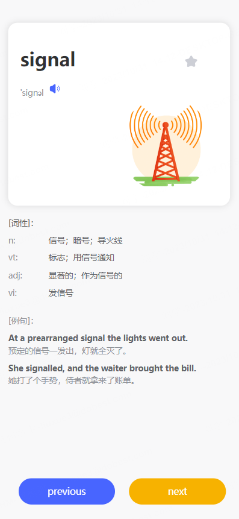

# 基于Vue + vite + ts的英语学习手机web前端项目
## 首页页面图片展示

## 学习页面图片展示


## 网站地址
[http://www.opslx.com](http://www.opslx.com)

## 测试请使用以下命令：
```
git clone https://github.com/opslx/ttyy.git
cd tttyy
npm install pnpm
npm install vite
pnpm install
npx vite --host=0.0.0.0 --port=4000
```
访问本地4000端口。
编译请使用```npx vite build```